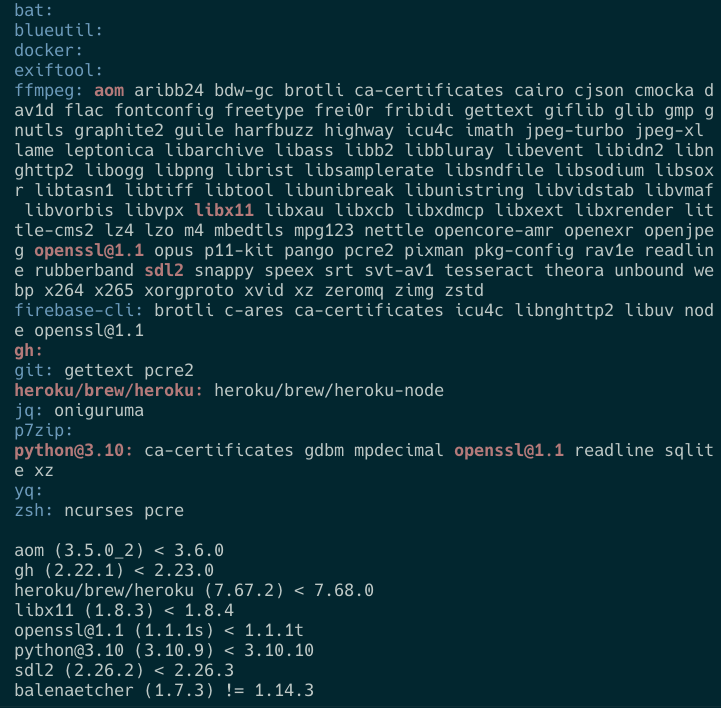
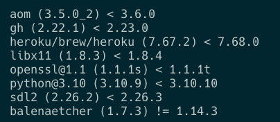

# Brew Outdated
## Description
Github CLI extension

Highlights all brew outdated formulas in their dependency tree so that it is easy to understand the source of unfamiliar outdated formula.

The extension also lists the outdated formulas in the traditional way to display the current version and the updated one.

## Installation

```bash
gh extension install davidraviv/gh-brew-outdated
```

## Usage

```bash
gh brew-outdated
```

## Screenshots

This extension highlights all outdated formulas in their dependency tree:


For a reference, this is a traditional `brew outdated` output:


## Dependencies
- brew
- zsh

## Contributing
Contribution is welcomed! Please open an issue or a pull request.

## Possible improvements
- Make `brew deps` and `brew outdated` run in parallel
- Add a spinner while each phase is running


